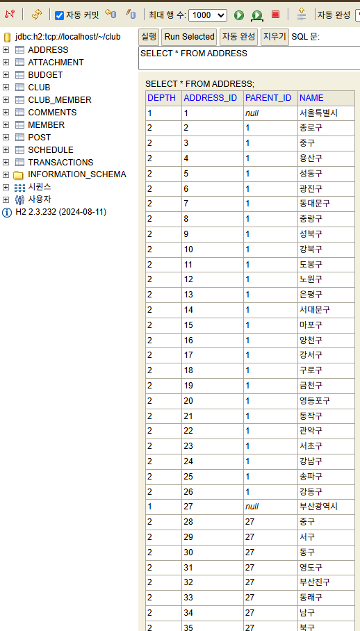
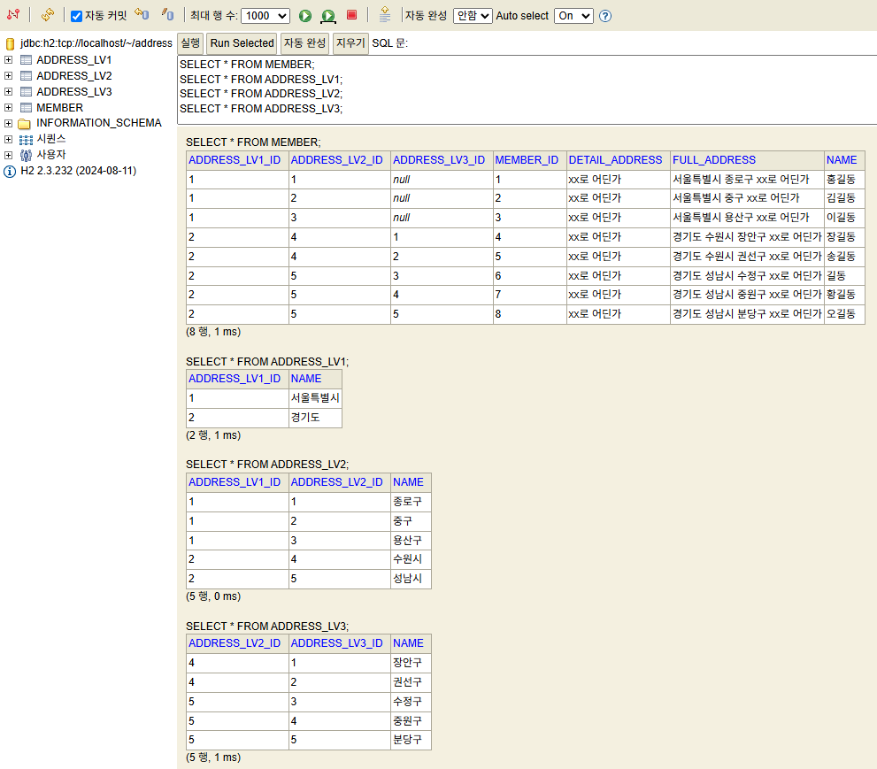
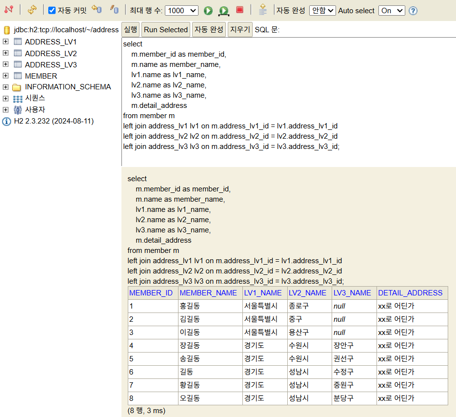
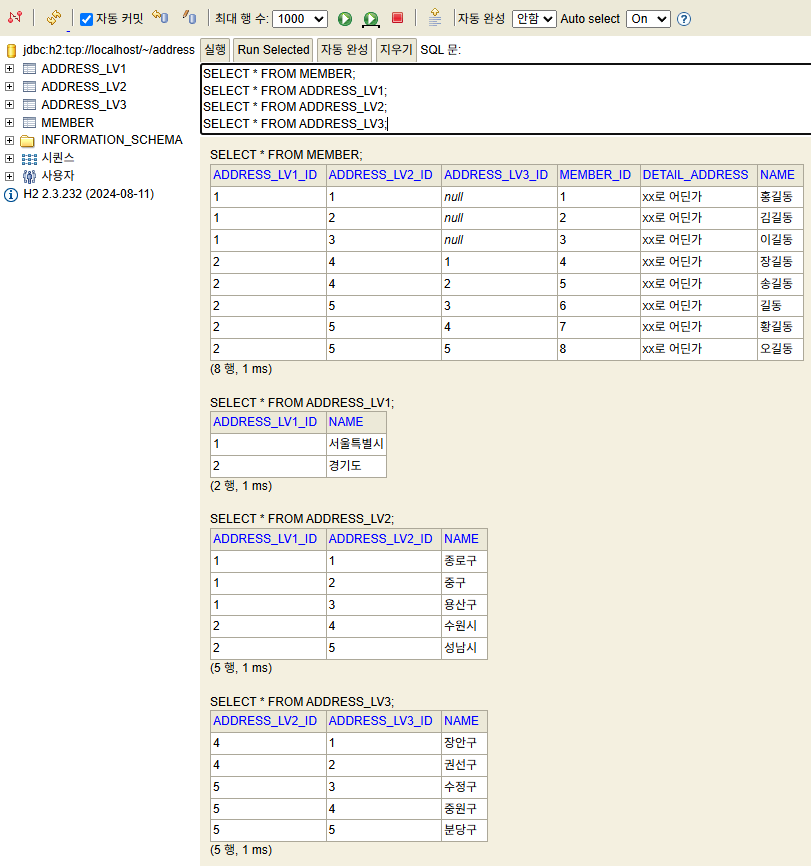

# 주소 계층구조 테스트

토이프로젝트에 사용할 주소 구조, 어떻게 하면 좋을지 테스트중.

- 지역별로 클럽을 등록/조회 등을 할 수 있어야 해서 직접 주소를 db에서 관리하기로 함.
- level 별로 조회가 가능해야 하고 (`select-box`에서 사용), 전체 full주소가 필요한 경우도 있다.
- level은 최소 2개 ~ 최대 3개까지 될 수 있다.
  - 서울특별시, 종로구
  - 경기도, 수원시, 장안구

## 1. Single Recursive Table 구조

1개에 테이블에 모든 주소 넣어서 관리함.

- 3개 계층을 `depth 1,2,3`로 구분.
- `parent_id`를 통해 `depth 3 -> 2 -> 1`으로 탐색해서 가져오도록 함.
- `detail_address`는 없는 상태.



> 위 이미지는 기존 토이프로젝트서 진행하던 것.

## 2. 계층별 table 분리 - `full_address` 포함

`member`에 `full_address`를 포함함.

- db에서 조회는 편하나, 데이터의 중복이 발생한다.



## 3. 계층별 table 분리 - `full_address` 제외

`member`에 `full_address`를 제외함.

- `full_address`는 아래 sql 처럼 `join`을 해서 db에서 보거나, (번거롭다)
- `member` 엔티티 내의 메서드(`getFullAddress()`)로 얻어올 수 있다. (편하다)






```
select 
    m.member_id as member_id,
    m.name as member_name,
    lv1.name as lv1_name,
    lv2.name as lv2_name,
    lv3.name as lv3_name,
    m.detail_address
from member m
left join address_lv1 lv1 on m.address_lv1_id = lv1.address_lv1_id
left join address_lv2 lv2 on m.address_lv2_id = lv2.address_lv2_id
left join address_lv3 lv3 on m.address_lv3_id = lv3.address_lv3_id;
```

```java
// member 엔티티
public String getFullAddress() {
    StringBuilder sb = new StringBuilder();

    if (addressLv1 != null) {
        sb.append(addressLv1.getName()).append(" ");
    }
    if (addressLv2 != null) {
        sb.append(addressLv2.getName()).append(" ");
    }
    if (addressLv3 != null) {
        sb.append(addressLv3.getName()).append(" ");
    }
    if (detailAddress != null) {
        sb.append(detailAddress);
    }

    return sb.toString().trim(); //서울특별시 중구 xx로 어딘가, 경기도 수원시 장안구 xx로 어딘가
    
}
```

## 결론

3번째 방법으로 진행해야겠다.