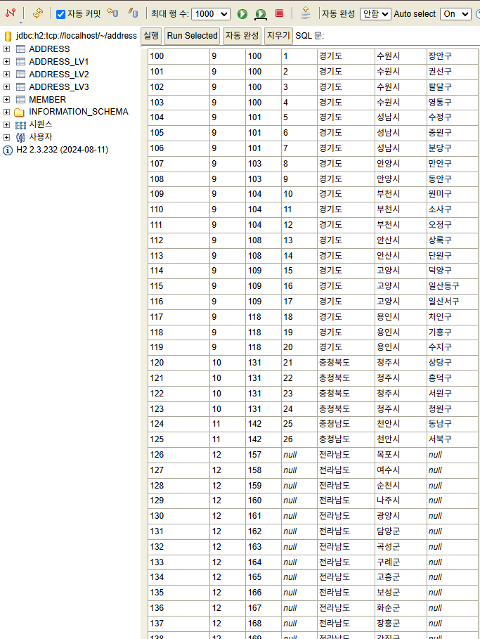

# 주소 계층구조 테스트

토이프로젝트에 사용할 주소 구조, 어떻게 하면 좋을지 테스트중.

- 사용할 데이터: [addresses.json](src/main/resources/addresses.json)
  - 참고: https://ko.wikipedia.org/wiki/대한민국의_행정_구역

- 지역별로 클럽을 등록/조회 등을 할 수 있어야 해서 직접 주소를 db에서 관리하기로 함.
- level 별로 조회가 가능해야 하고 (`select-box`에서 사용), 전체 full주소가 필요한 경우도 있다.
- level은 최소 2개 ~ 최대 3개까지 될 수 있다.
  - 서울특별시, 종로구
  - 경기도, 수원시, 장안구

## 1. Single Recursive Table 구조

1개에 테이블에 모든 주소 넣어서 관리함.

- 3개 계층을 `depth 1,2,3`로 구분.
- `member` 엔티티에는 가장 구체적인 주소의 id만 저장함. (`depth2` or `depth3`)
- `parent_id`를 통해 `depth 3 -> 2 -> 1`으로 탐색해서 가져오도록 함. (번거롭다...)
- `detail_address`는 없는 상태.


> 위 이미지는 기존 토이프로젝트서 진행하던 것.

## 2. Single Flat Table 구조

1개에 테이블에 모든 주소 넣어서 관리함.

- `address`에 3개 계층을 문자열 그대로 한 줄에 저장.
- `address_id` 별로 조회는 쉽지만, 데이터 중복 발생.

| address_id | address_lv1 | address_lv2 | address_lv3 | 
|------------|-------------|-------------|-------------|
| 1          | 서울특별시       | 종로구         |             | 
| 2          | 서울특별시       | 중구          |             | 
| 3          | 서울특별시       | 용산구         |             | 
| 4          | 경기도         | 수원시         | 장안구         | 
| 5          | 경기도         | 성남시         | 수정구         | 
| 6          | 경기도         | 성남시         | 분당구         | 

## 3. 계층별 table 분리 구조

3개 계층을 각각의 table로 분리함.

### 3-1. `full_address` 포함

`member`에 `full_address`를 포함함.

- db에서 조회는 편하나, 데이터의 중복이 발생한다.


### 3-2. `full_address` 제외

`member`에 `full_address`를 제외함.

- `full_address`는 아래 sql 처럼 `join`을 해서 db에서 보거나, (번거롭다)
- 자바단에서 `member` 엔티티 내의 메서드로 얻어올 수 있다. (편하다)
- 랜덤 주소가 필요할 때, `lv1, lv2, lv3`의 연관관계를 한번 더 생각해야 한다.

<details>
<summary>SQL</summary>

```
select 
    m.member_id as member_id,
    m.name as member_name,
    lv1.name as lv1_name,
    lv2.name as lv2_name,
    lv3.name as lv3_name,
    m.detail_address
from member m
left join address_lv1 lv1 on m.address_lv1_id = lv1.address_lv1_id
left join address_lv2 lv2 on m.address_lv2_id = lv2.address_lv2_id
left join address_lv3 lv3 on m.address_lv3_id = lv3.address_lv3_id;
```
</details>


<details>
<summary>SQL (member 없이 주소만.)</summary>

```
-- 주소 db 조인. (한눈에 전체보기)
SELECT
    lv1.name AS lv1,
    lv2.name AS lv2,
    lv3.name AS lv3,
    lv1.address_lv1_id AS lv1_id,
    lv2.address_lv2_id AS lv2_id,
    lv3.address_lv3_id AS lv3_id
FROM
    address_lv1 lv1
JOIN
    address_lv2 lv2 ON lv2.address_lv1_id = lv1.address_lv1_id
LEFT JOIN
    address_lv3 lv3 ON lv3.address_lv2_id = lv2.address_lv2_id
```
</details>

## 4. 계층별 table 분리 & 통합 테이블 구조

계층별로 테이블을 분리하고, `lv1, lv2, lv3`의 계층이 유효한 주소를 하나의 통합 테이블에 보관한다.

- 랜덤 주소가 필요할때 그냥 통합테이블(`Address`)에서 랜덤으로 하나 가져오면 된다.

### Address 테이블


<details>
<summary>주소 조회 SQL. (실제 주소명은 join해서 가져옴.)</summary>

```
-- 주소 조회 (join해서 실제 주소이름 볼 수 있도록)
SELECT
  a.address_id,
  a.address_lv1_id AS lv1_id,
  a.address_lv2_id AS lv2_id,
  a.address_lv3_id AS lv3_id,
  lv1.name AS lv1_name,
  lv2.name AS lv2_name,
  lv3.name AS lv3_name
FROM address a
LEFT JOIN address_lv1 lv1 ON a.address_lv1_id= lv1.address_lv1_id
LEFT JOIN address_lv2 lv2 ON a.address_lv2_id= lv2.address_lv2_id
LEFT JOIN address_lv3 lv3 ON a.address_lv3_id= lv3.address_lv3_id;
```
</details>




### member 테이블


<details>
<summary>member 조회 SQL</summary>

```
-- 주소 조회 (join해서 실제 주소이름 볼 수 있도록)
SELECT
  a.address_id,
  a.address_lv1_id AS lv1_id,
  a.address_lv2_id AS lv2_id,
  a.address_lv3_id AS lv3_id,
  lv1.name AS lv1_name,
  lv2.name AS lv2_name,
  lv3.name AS lv3_name
FROM address a
LEFT JOIN address_lv1 lv1 ON a.address_lv1_id= lv1.address_lv1_id
LEFT JOIN address_lv2 lv2 ON a.address_lv2_id= lv2.address_lv2_id
LEFT JOIN address_lv3 lv3 ON a.address_lv3_id= lv3.address_lv3_id;
```
</details>


## 결론

마지막 4번을 토이프로젝트에 적용해야겠다.

https://github.com/JohnKim0911/badminton_club